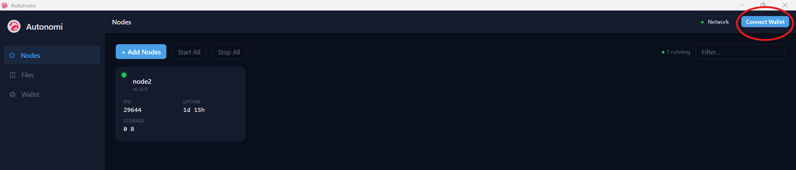

# Uploading & downloading files

> **Status:** Placeholder — content to be written.

1. Once you download the Autonomi App, please open it and select **Connect Wallet**

<figure><figcaption></figcaption></figure>

2. You will have multiple options of wallets to use. We recommend using MetaMask&#x20;

<figure><figcaption></figcaption></figure>

3. You will now have a popup on your laptop/desktop asking you to scan a QR code. Scan that with your smartphone and go to the link. Please note you will need to have previously setup a Metamask account on your phone. If you have not done that yet please see [wallets.md](wallets.md "mention")to learn how to setup a MetaMask wallet on your laptop/desktop. After you have done that you can import the private key or seed phrase onto your smartphone and you will now have access to your wallet on both your laptop/desktop and your smartphone.&#x20;

<figure><figcaption></figcaption></figure>

4. On your smartphone please enter your MetaMask password then you will see the following popup. Please select **Connect** and then you can return to your laptop/desktop Autonomi App.&#x20;

<figure><figcaption></figcaption></figure>

5. You have no sucessfully linked your wallet. Now select the **Files** button on the far left of the Autonomi App and then click the **Upload File(s)** button.

<figure><figcaption></figcaption></figure>

6. Now select the file you want to upload from your computer. Once that is done you will wait on a quote. This can take a few minutes, but once complete you must select **Approve Upload**.&#x20;

<figure><figcaption></figcaption></figure>

7. Now check your MetaMask on your smartphone and approve the transaction.&#x20;

<figure><figcaption></figcaption></figure>

8. Now if you go back to the Autonomi App you should see that the upload was successful and shows the status as **Done**. Next lets try to download the file. Select **Download by Datamap**.&#x20;

<figure><figcaption></figcaption></figure>

9. Select the desired file that you have already uploaded.&#x20;

<figure><figcaption></figcaption></figure>

10. Click **Download**&#x20;

<figure><figcaption></figcaption></figure>

11. Select **Downloaded - click to open**&#x20;

<figure><figcaption></figcaption></figure>

12. Congratulations! The file has now been saved to your computer!
